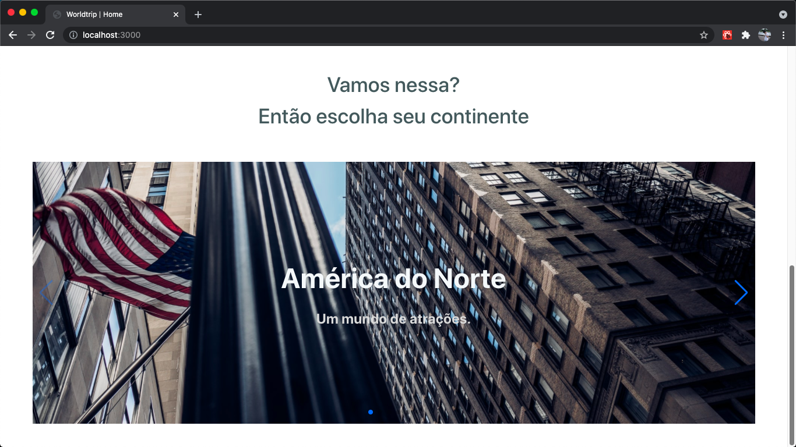
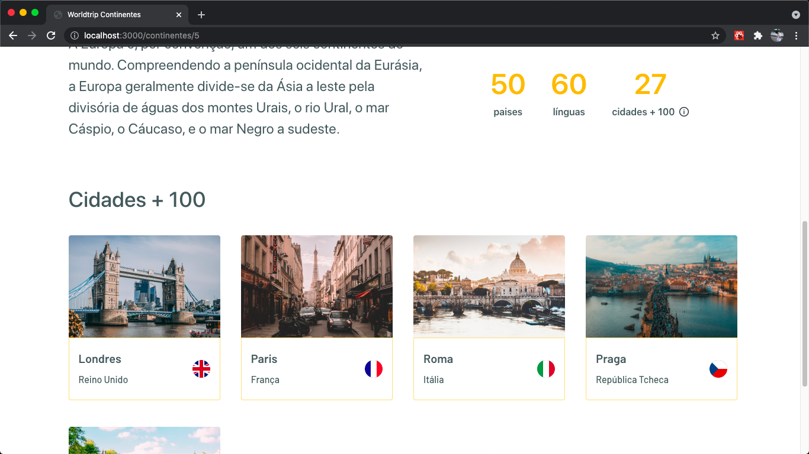

    

 

# 📸 Overview:

   

# 💻 Projeto:

A aplicação foi uma proposta de desafio facultativo do treinamento Ignite (ReactJS) da Rocketseat.    
Nesse desafio foram utilizados conceitos como interface declarativa, em que foi usada a biblioteca Chakra UI para construir toda a interface das páginas.

# 🚀 Tecnologias:

### ✔️ ReactJS

### ✔️ NextJS

### ✔️ Axios

### ✔️ json-server (Fake API)

### ✔️ Chakra UI

### ✔️ SwiperJS
